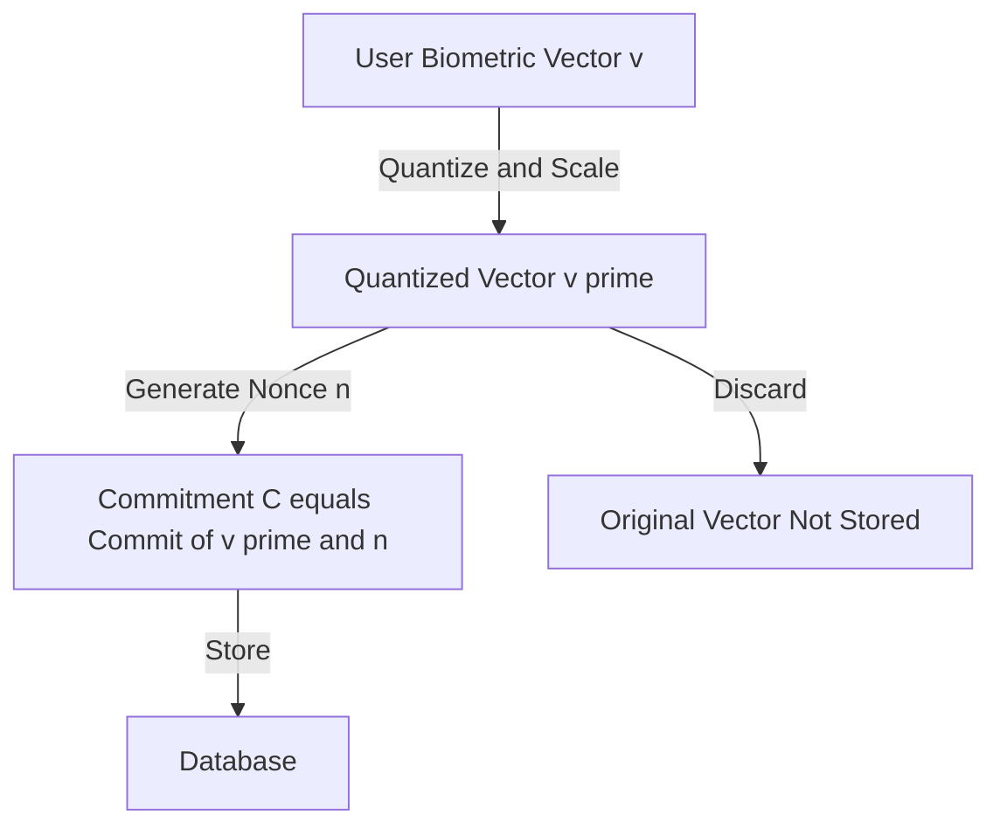
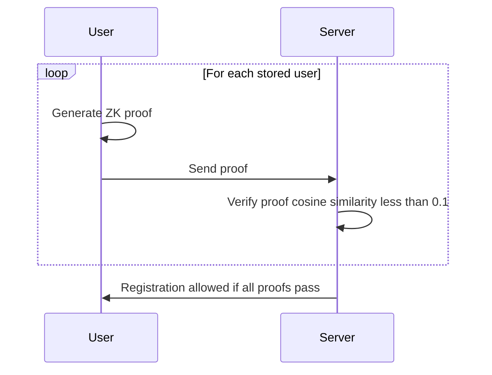
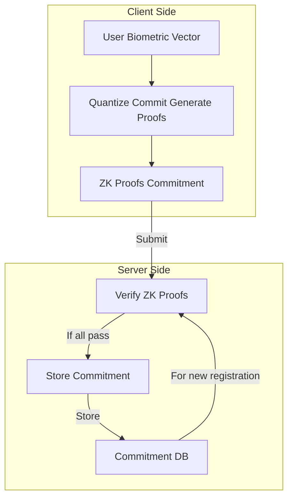

# ZK Match Architecture

## 1. Overview of ZK-based Approach

**Technique:** zkSNARKs (Zero-Knowledge Succinct Non-Interactive Arguments of Knowledge) using Circom and snarkjs.

**Justification:**
- Efficient, short proofs and fast verification
- Well-supported tooling (Circom, snarkjs)
- Expressive enough for complex relations (cosine similarity)

---

## 2. Vector Transformation Method

**Goal:** Store a transformed version of the biometric vector so the original cannot be reconstructed, even if the database is compromised.

**Approach:**
- Quantize and scale the vector to integers (e.g., [-1000, 1000])
- Generate a random nonce per user
- Compute a cryptographic commitment: `C = Commit(v, n)` (e.g., SHA256(v || n))
- Store only the commitment (and optionally the nonce)

**Diagram:**


---

## 3. Similarity Verification Method (Cosine Similarity, 10% Threshold)

**Goal:** When a new user registers, ensure their vector is not too similar (cosine similarity ≥ 0.1) to any existing user, without revealing any vectors.

**Approach:**
- For each stored commitment, the user generates a ZK proof that:
  - They know a vector and nonce matching the commitment
  - The cosine similarity between the new vector and the stored one is < 0.1
- The server verifies all proofs; if all pass, registration is allowed

**Pseudo-code:**
```javascript
for each stored commitment C_i:
    User proves in ZK:
        - Knows v_i, n_i such that Commit(v_i, n_i) == C_i
        - cos_sim(v_new, v_i) < 0.1
    Server verifies proof for all i
If all proofs pass, allow registration
```

**Diagram:**


---

## 4. High-Level Architecture Diagram



---

## 5. Security, Privacy & Performance Considerations

**Security & Privacy:**
- Only commitments are stored; raw vectors are never stored or transmitted
- ZK proofs ensure the server never learns the actual biometric vectors
- Nonces prevent dictionary/rainbow table attacks
- Trusted setup required for zkSNARKs (multi-party recommended)

**Performance & Scalability:**
- Proof generation is computationally intensive (client-side)
- Verification is fast (server-side)
- For large user bases, use batching, approximate search, or hierarchical filtering

---

## 6. Testing & Validation

- **ZK Circuit Testing:** Use Circom's test suite for edge cases (e.g., vectors at threshold, all-zeros, all-ones)
- **End-to-End Testing:** Simulate registration and verification flows with valid/invalid proofs
- **Security Audits:** Review commitment scheme and ZK circuit; consider third-party audits for production

---

## 7. Developer Notes

- See code comments in key files for privacy/security explanations
- For production, use encrypted, persistent storage and a secure trusted setup
- All architectural decisions and diagrams are in this document
- For questions, see the README or contact the project maintainer